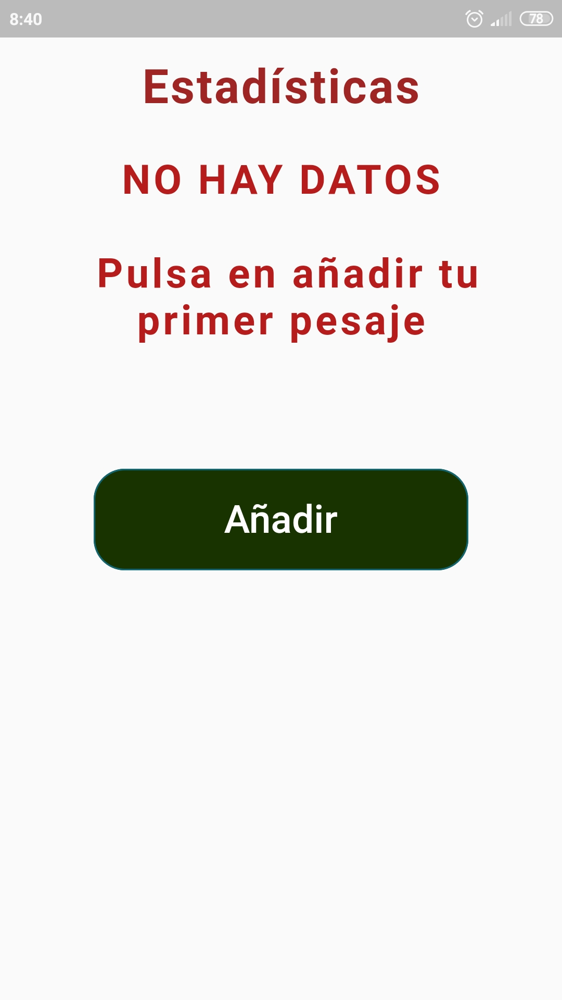
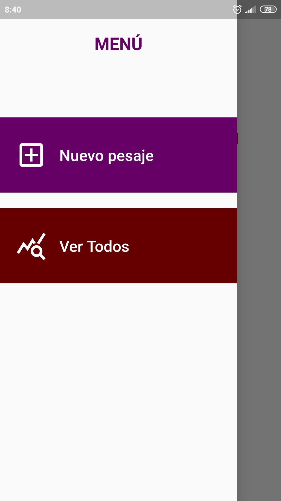
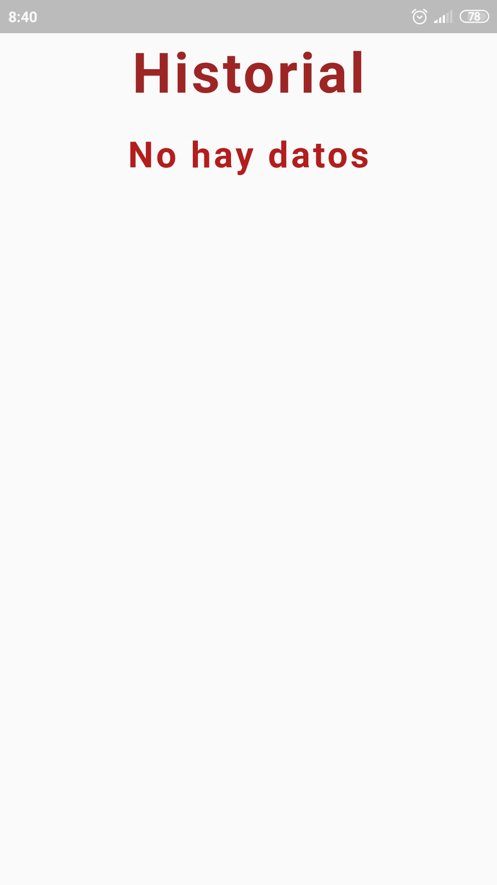
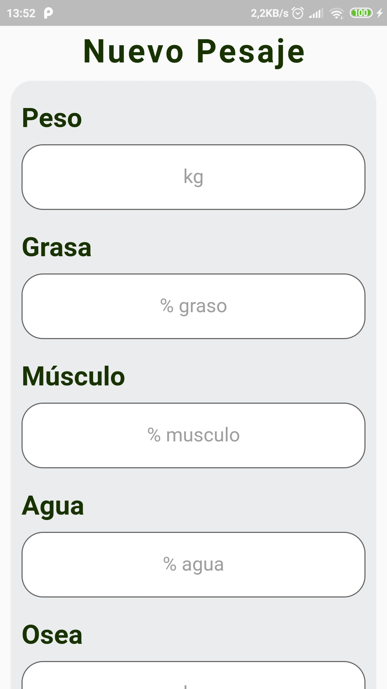
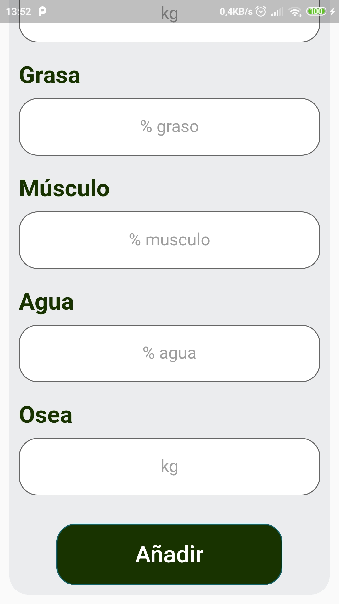
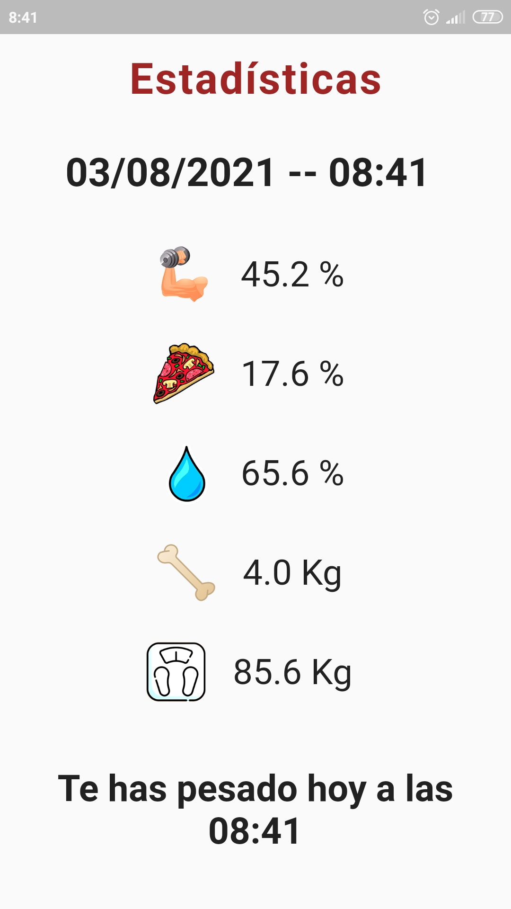
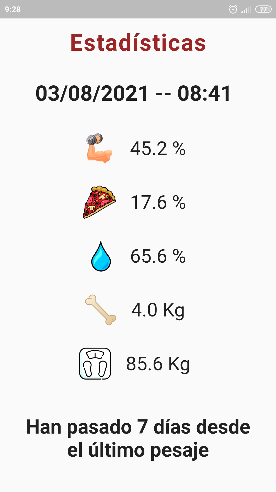
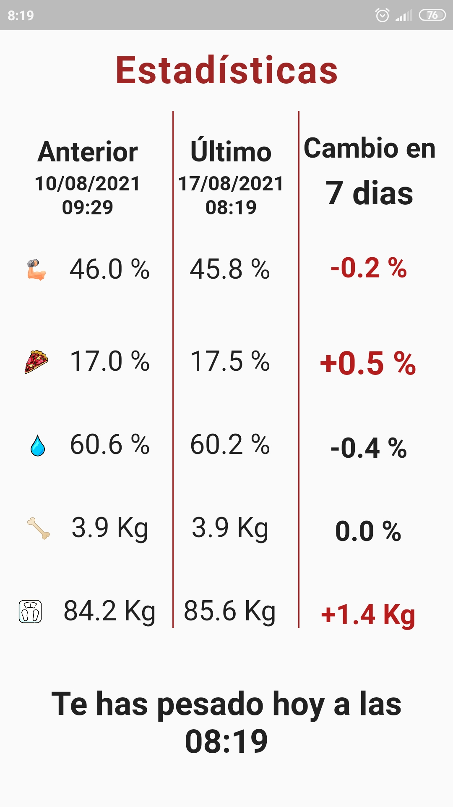
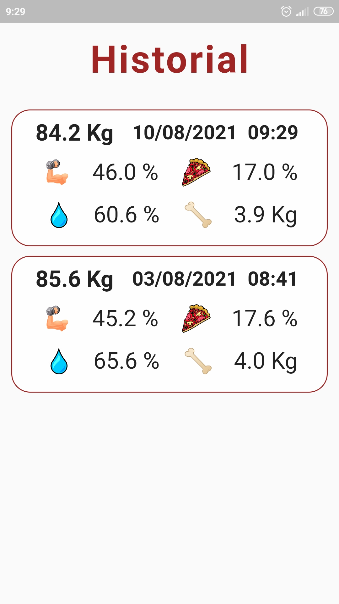

# Historial Peso

Creado con Flutter este consiste en la creación de una aplicación que funcionará en los dispositivos Android con una versión superior al 7.0 con una cobertura superior al 90% de los dispositivos que funcionan en este sistema operativo.

La aplicación guardara de forma local todos los datos que se introduzcan para así poder visualizarse después y poder hacer comparaciones con mediciones anteriores.

El objetivo que se pretende conseguir guardando estas mediciones es de poder visualizar de manera más cómoda la evolución que se está realizando de los diferentes valores corporales. Estos valores que se medirán serán:
* Peso (Kg)
* Músculo (%)
* Grasa (%)
* Agua Corporal (%)
* Masa Ósea (Kg)

**Todas las mediciones tendrán que realizarse con una báscula que permita obtener al menos estos 5 valores**

Lo primero que veremos nada más ingresar en la aplicación será la pantalla de Home vacía y el menú al que solo se puede acceder **deslizando desde el borde izquierdo hacia el centro.** Al pulsar sobre *Ver Todos* nos saldrá la tercera imagen que tiene como título *Historial* que tampoco tiene datos.

   &nbsp;&nbsp;&nbsp; 
  
   &nbsp;&nbsp;&nbsp; 
  

Si pulsamos en el botón de añadir nos aparecerá la pantalla en la que tenemos que escribir los datos que nos proporcione nuestra báscula y pulsar añadir. **ATENCIÓN: Es obligatorio que todos los datos sean introducidos, de no ser así la aplicación no deja continuar.**

   &nbsp;&nbsp;&nbsp;&nbsp;&nbsp;&nbsp; 
  

Una vez añadido cambiará nuestra pantalla de Home, ya que ya si tenemos valores.

La pantalla anterior nos mostraba información del último pesaje, si a la semana volvemos a meternos en la aplicación nos aparecerá un mensaje como el de la siguiente imagen:

La pantalla donde se guardan todos los registros ("Historial") también se irá actualizando según introduzcamos valores. Aparecerán ordenados de manera inversa a la temporal apareciendo así en las primeras posiciones los últimos valores introducidos.

Si añadimos un segundo registro, el Home nos cambiara y nos ofrecerá la diferencia entre los dos últimos pesajes, indicando también el tiempo que ha pasado entre la medición de esos dos valores. En el historial también se irán añadiendo en el orden descrito anteriormente. Los cambios obtenidos entre las dos mediciones considerados positivos se marcarán en verde y los negativos en rojo.

   &nbsp;&nbsp; 
 
    &nbsp;&nbsp; 
   

## Mejoras Futuras

* Introducción de perfiles para llevar la medición de varios usuarios.
* Comprobación de errores de datos introducidos, puesto que no existe ningún tipo de control.
* Modificación y eliminación de registros.
* Comparación entre dos pesajes seleccionables.

## Trabajos Relacionados

Existe una versión idéntica a este proyecto que almacena los datos de forma remota en gracias al servicio gratuito de Firebase. Esta versión por temas de claves y limitaciones por el propio Firebase la mantengo privada.
